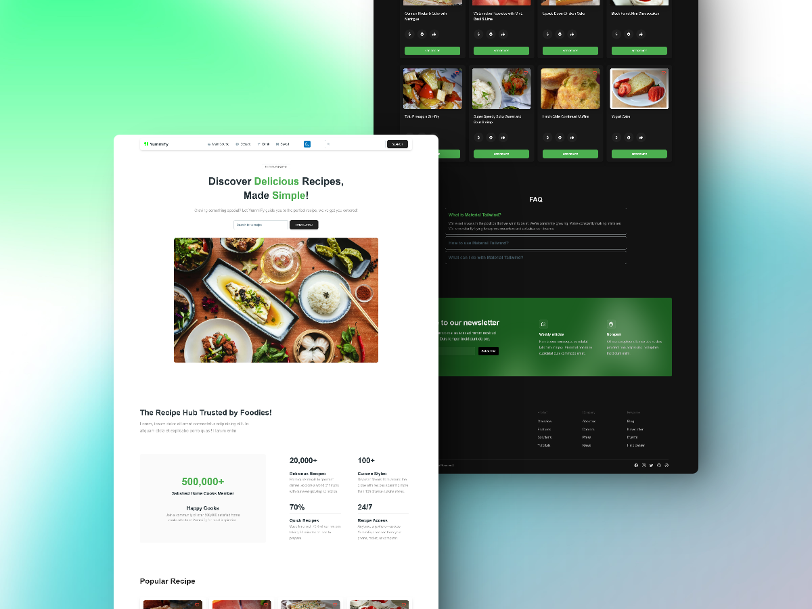

# YummiFy 🍴

YummiFy is a single page application recipe website integrated with Spoonacular API built with React.js, Redux, Tailwind CSS and uses Material-Tailwind as UI components library.



## Features

- **Recipe Categories**: Display recipes categorized into sections such as Main Course, Dessert, and Drink recipes with dedicated pages for each.
- **Search Recipe**: Users can search for recipe by input a keyword.
- **Save Recipe**: Users can save recipes for later and access it in "Saved" page.
- **Dark/Light Mode**: User able to switch the website theme to Dark/Light mode.
- **Responsive**: Users can access the website on a variety of devices such as Mobile, Tablet and Dekstop/Laptop.

## Technologies Used

- **React.js**: JavaScript library for building user interfaces.
- **Tailwind CSS**: Utility-first CSS framework for rapid and responsive styling.
- **Redux**: A JS library for predictable and maintainable global state management
- **Material-Tailwind**: An open-source library that uses the power of Tailwind CSS and React to build website faster.

## Installation

To get started with this project, make sure you have [Node.js](https://nodejs.org/) installed. Then, follow these steps:

1. **Clone the Repository**:

   ```bash
   git clone https://github.com/mariotbg11/YummiFy.git
   cd YummiFy
   ```

2. **Install Dependencies**:

   ```bash
   npm install
   ```

3. **Run the Project**:

   ```bash
   npm run dev
   ```

   The project will run on `http://localhost:5173` by default.
